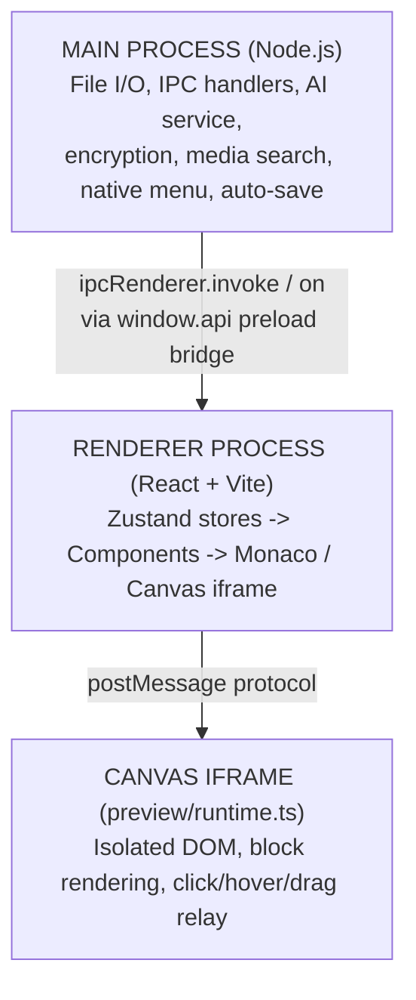

# Amagon HTML Editor — Codebase Guidelines

> **Purpose:** This file gives AI assistants (Claude, Gemini, ChatGPT, etc.) enough context to work on this codebase without reading every file. Keep it up-to-date as the project evolves.
>
> **Documentation Maintenance Rule:** When you add, remove, or significantly change a feature, update the following docs in the same PR or commit:
> - **`GUIDELINES.md`** (this file) — architecture, data models, IPC channels, conventions
> - **`README.md`** — user-facing feature list, project structure, getting started
> - **`docs/getting-started-contributing.md`** — contributor-facing "where to look" guide and architecture overview
> - **`.aiassistant/rules/project-context.md`** — concise system cheat-sheet for AI assistants
>
> These four files should always stay in sync. If a feature is documented in one, it should be discoverable in the others.

---

## 1. What Is This?

**Amagon HTML Editor** is an offline, AI-powered visual HTML editor — a desktop alternative to Pingendo, Mobirise, and Bootstrap Studio. Users drag-and-drop blocks onto a canvas, edit properties in an inspector panel, toggle to a Monaco code editor for raw HTML, and export standalone sites.

- **Repo:** `github.com/Shin-Aska/amagon-html-editor`
- **License:** GPL v3.0
- **App ID:** `com.hoarses.editor`

---

## 2. Tech Stack

| Layer | Technology |
|-------|------------|
| Desktop shell | Electron 41 |
| Frontend | React 19, TypeScript 6.0 |
| Build | Vite 7 via electron-vite 5 |
| State | Zustand 5 |
| Code editor | Monaco Editor 0.53 |
| Drag-and-drop | @dnd-kit/core + sortable |
| HTML parsing | parse5 8 |
| Formatting | Prettier 3.8 |
| Icons | lucide-react |
| Testing | Vitest 4 + jsdom |
| Packaging | electron-builder 26 |

---

## 3. Project Structure

```
src/
├── main/                   # Electron main process (Node.js)
│   ├── index.ts            # Entry point, IPC handlers, file I/O
│   ├── aiService.ts        # Multi-provider AI adapter
│   ├── cliHelpers.ts       # CLI provider discovery and model probing
│   ├── cryptoHelpers.ts    # API key encryption (safeStorage / AES-256-GCM)
│   ├── credentialCatalog.ts # Credential definition registry for all providers
│   ├── publishCredentials.ts # Publish credential storage helpers
│   ├── mediaSearchService.ts # Pexels/Pixabay image search
│   └── menu.ts             # Native app menu
│
├── preload/
│   └── index.ts            # contextBridge → exposes `window.api`
│
├── preview/
│   └── runtime.ts          # Runs inside the canvas iframe
│
├── publish/                # Publish-to-web extension system
│   ├── index.ts            # Public entry point
│   ├── registry.ts         # Publisher registration and lookup
│   ├── types/              # PublisherExtension, PublishResult, ValidationResult, etc.
│   ├── providers/
│   │   ├── github/         # GitHub Pages adapter
│   │   ├── cloudflare/     # Cloudflare Pages adapter
│   │   ├── neocities/      # Neocities adapter
│   │   └── aws-s3/         # AWS S3 static-site adapter
│   └── validators/         # Per-provider credential + file validators
│
├── renderer/               # React app (Vite-bundled)
│   ├── App.tsx             # Root component, layout orchestration
│   ├── canvas.html         # Iframe shell for live preview
│   ├── canvasRuntime.ts    # Canvas initialisation
│   │
│   ├── components/         # ~30 top-level components
│   │   ├── AiAssistant/    # AI chat panel + AiProposalReviewPanel (diff editor for AI proposals)
│   │   ├── Canvas/         # Iframe wrapper for visual editing
│   │   ├── CodeEditor/     # Monaco editor wrapper
│   │   ├── Inspector/      # Property/style panel (~20 sub-components)
│   │   │   └── FontPickerField.tsx  # Per-block font dropdown (button trigger + portal)
│   │   ├── ThemeEditor/    # Visual theme editor (colors, typography, etc.)
│   │   │   ├── FontManager.tsx           # Import custom font files (.ttf/.otf/.woff/.woff2)
│   │   │   ├── GoogleFontBrowser.tsx     # Browse, search, and download Google Fonts from bundled catalog
│   │   │   ├── GoogleFontBrowser.css     # Styles for Google Fonts browser UI
│   │   │   └── TypographyFontPicker.tsx  # Theme-level font dropdown (button trigger + portal)
│   │   ├── Sidebar/        # Block library + page tree
│   │   ├── Toolbar/        # Action buttons
│   │   ├── CommandPalette/ # Cmd+K search
│   │   ├── ExportDialog/   # Export configuration
│   │   ├── PublishDialog/  # Publish-to-web UI (provider selection, credentials, progress)
│   │   ├── NewProjectWizard/
│   │   ├── SettingsDialog/ # Includes CredentialEditModal for per-service credential editing
│   │   ├── AssetManager/   # Media/asset UI
│   │   ├── CredentialManager/ # API key overview popover in toolbar
│   │   ├── BlockTree/      # DOM tree visualisation
│   │   ├── ContextMenu/
│   │   ├── StatusBar/      # Status bar with tutorial progress feedback
│   │   ├── Toast/          # Notifications
│   │   ├── Tutorial/       # Interactive onboarding overlay system
│   │   │   ├── TutorialOverlay.tsx   # Main overlay controller
│   │   │   ├── TutorialInfoBox.tsx   # Step info box with choices
│   │   │   ├── SpotlightMask.tsx     # Spotlight highlight mask
│   │   │   ├── TutorialArrow.tsx     # Directional pointer arrow
│   │   │   ├── WelcomeTourDialog.tsx # Initial welcome / tutorial launch dialog
│   │   │   ├── tutorialSteps.ts      # Core step definitions
│   │   │   └── branches/            # Branching tutorial paths
│   │   │       ├── aiAssistanceTutorial.ts
│   │   │       ├── publishTutorial.ts
│   │   │       └── webMediaSearchTutorial.ts
│   │   └── …others (WelcomeScreen, AboutAmagon, PageModal, etc.)
│   │
│   ├── data/               # Static data files and catalog
│   │   ├── google-fonts-catalog.json   # Bundled catalog of ~1,500 Google Fonts metadata
│   │   └── googleFontsCatalog.ts       # Typed module exporting catalog and preview URL helper
│   │
│   ├── store/              # Zustand stores
│   │   ├── editorStore.ts  # Blocks, selection, history, clipboard
│   │   ├── projectStore.ts # Project settings, pages, themes, user blocks
│   │   ├── aiStore.ts      # AI chat state and config
│   │   ├── appSettingsStore.ts # UI preferences (theme, layout, tutorial state)
│   │   ├── tutorialStore.ts    # Interactive tutorial step state and action listener
│   │   ├── toastStore.ts   # Notification state
│   │   └── types.ts        # Shared TypeScript types
│   │
│   ├── registry/
│   │   ├── ComponentRegistry.ts # Block type registry class
│   │   └── registerBlocks.ts    # 50+ block definitions
│   │
│   ├── utils/
│   │   ├── blockToHtml.ts  # Block → HTML serialisation
│   │   ├── htmlToBlocks.ts # HTML → Block parsing
│   │   ├── exportEngine.ts # Export to file(s)
│   │   ├── api.ts          # IPC bridge wrapper
│   │   └── …helpers
│   │
│   ├── constants/
│   │   └── tutorialEvents.ts # Tutorial action type constants
│   │
│   ├── hooks/
│   │   └── useKeyboardShortcuts.ts
│   │
│   └── styles/             # Component CSS files
│
└── shared/
    └── welcomeBlocks.ts    # Default welcome page template
```

---

## 4. Architecture Overview



**Key patterns:**
- **IPC bridge** — The preload script (`preload/index.ts`) exposes a typed `window.api` object with namespaces: `project`, `assets`, `autosave`, `menu`, `app`, `ai`, `mediaSearch`, `fonts`.
- **Block-based model** — The UI is a tree of `Block` objects, not direct DOM manipulation. Blocks have `id`, `type`, `props`, `styles`, `classes`, `events`, `children`.
- **Bidirectional sync** — `blockToHtml` and `htmlToBlocks` keep the visual canvas and code editor in sync.
- **Canvas isolation** — The live preview runs in an iframe. The renderer and iframe communicate via `postMessage`.

---

## 5. Data Models

### Block

```typescript
interface Block {
  id: string                        // e.g. "blk_abc123"
  type: string                      // registered block type
  tag?: string                      // HTML tag override
  props: Record<string, unknown>    // component-specific properties
  styles: Record<string, string>    // inline CSS
  classes: string[]                 // CSS class names
  events?: Record<string, string>   // JS event handlers
  content?: string                  // raw HTML escape hatch
  children: Block[]                 // nested blocks
  locked?: boolean                  // prevents editing
}
```

### FontAsset

```typescript
interface FontAsset {
  id: string           // uuid generated on import
  name: string         // CSS font-family name (e.g. "MyFont")
  relativePath: string // path inside project dir (e.g. "assets/fonts/MyFont.woff2")
  format: string       // 'ttf' | 'otf' | 'woff' | 'woff2'
  weight?: string      // CSS font-weight (default '400')
  style?: string       // 'normal' | 'italic' (default 'normal')
}
```

FontAssets are stored in `state.fonts` (top-level in projectStore, not nested under `settings`). System fonts have an empty `relativePath` and are resolved by CSS name only.

### Project File (`.json`)

```typescript
{
  version?: string
  settings: {
    name: string
    framework: 'bootstrap-5' | 'tailwind' | 'vanilla'
    theme: ProjectTheme
    themeVariants?: ProjectThemeVariants
    customCss?: string
    fonts?: FontAsset[]  // persisted font definitions
  }
  pages: Page[]          // each has id, title, slug, blocks[], meta
  folders: PageFolder[]  // organisational grouping
  userBlocks: UserBlock[] // saved reusable blocks
  customPresets?: ProjectTheme[]
  publisherConfig?: PublisherConfig  // selected provider + last publish metadata
}
```

### PublisherConfig

```typescript
interface PublisherConfig {
  providerId: string          // e.g. 'github-pages', 'cloudflare-pages', 'neocities', 'aws-s3'
  encryptedCredentials?: string
  lastPublishedUrl?: string
  lastPublishedAt?: string
}
```

### Theme

```typescript
interface ProjectTheme {
  name: string
  colors: { primary, secondary, accent, background, surface, text, textMuted, border, success, warning, danger }
  typography: { fontFamily, headingFontFamily, baseFontSize, lineHeight, headingLineHeight }
  spacing: { baseUnit: string, scale: number[] }
  borders: { radius, width, color }
  customCss: string
  customCssFiles: CssFile[]
}
```

Themes compile to `--theme-*` CSS custom properties. Light/dark variants are supported via `html[data-page-theme]` and `prefers-color-scheme`.

### ComponentTokens

```typescript
interface ComponentTokens {
  shadows: { sm, md, lg, xl }
  button: { borderRadius, padding, fontWeight, textTransform, shadow }
  card: { borderRadius, shadow, borderWidth, padding }
  headings: { fontWeight, letterSpacing }
  form: { inputBorderRadius, inputPadding, labelFontWeight }
}
```

Component tokens are per-theme design parameters that control shadows, button styling, card styling, heading typography, and form element defaults. They are stored in `theme.componentTokens` and referenced by UI components to maintain consistent styling across blocks. See `src/renderer/themes/componentTokens.ts` for the default token factory.

---

## 6. Zustand Stores

| Store | File | Responsibility |
|-------|------|---------------|
| `editorStore` | `store/editorStore.ts` | Current page blocks, selection, 50-step undo/redo, clipboard, drag state, layout |
| `projectStore` | `store/projectStore.ts` | Project settings, pages, folders, theme variants, user blocks, custom presets, publisher config |
| `aiStore` | `store/aiStore.ts` | AI chat messages, loading state, provider config, model lists |
| `appSettingsStore` | `store/appSettingsStore.ts` | App-level UI preferences (light/dark theme, default layout, tutorial enabled/completed flags, show restart-tutorial button, dangerous features toggle) |
| `tutorialStore` | `store/tutorialStore.ts` | Interactive tutorial step state, branching paths, reactive action listener |
| `toastStore` | `store/toastStore.ts` | Notification display |

---

## 7. AI Integration

**Supported providers:** OpenAI, Anthropic, Google Gemini, Ollama (local), Mistral, Codex CLI, Gemini CLI, GitHub Copilot CLI, Junie CLI, Opencode CLI.

The AI service lives in `src/main/aiService.ts`. It:
1. Builds a system prompt from the block registry + current theme context
2. Dispatches chat to the selected provider's API
3. Parses block-array JSON from the response
4. Returns blocks the renderer can insert into the page

**IPC channels:** `ai:chat`, `ai:getConfig`, `ai:setConfig`, `ai:getModels`, `ai:fetchModelsForProvider`, `ai:checkCliAvailability`.

**CLI providers** run local CLI binaries instead of API calls. Gemini CLI and Junie CLI are gated behind the "Enable Dangerous Features" toggle; Codex CLI, GitHub Copilot CLI, and Opencode CLI are available without that toggle. GitHub Copilot CLI uses the standalone `copilot` binary with `copilot -p`; do not integrate it through `gh models`. Its model dropdown is populated from `copilot help config` plus `COPILOT_MODEL` / `~/.copilot/config.json`, because `/model` is an interactive slash command.

**CLI model discovery:** Available models for CLI providers depend on the installed CLI version. The AI settings tab shows a hint reminding users to update their CLI tool to access newer models.

API keys are encrypted at rest using Electron `safeStorage` (OS keyring) with an AES-256-GCM fallback. Keys are stored per-provider in `ai-config.json` and never leave the main process.

---

## 8. IPC Channels Reference

| Namespace | Key Channels |
|-----------|-------------|
| `project` | `save`, `saveAs`, `load`, `loadFile`, `exportHtml`, `exportSite`, `openInBrowser`, `getRecent`, `new`, `getDir` |
| `assets` | `selectImage`, `selectSingleImage`, `selectVideo`, `list`, `delete`, `readAsset`, `readFileAsBase64`, `import` |
| `autosave` | `start`, `stop` + `auto-save-tick` event |
| `menu` | `setProjectLoaded` + `menu:action` event |
| `app` | `getVersion`, `isEncryptionSecure`, `getCredentials`, `getCredentialDefinitions`, `getCredentialValues`, `saveCredential`, `deleteCredential`, `getSettings`, `saveSettings` |
| `ai` | `chat`, `getConfig`, `setConfig`, `getModels`, `fetchModelsForProvider` |
| `mediaSearch` | `getConfig`, `setConfig`, `search`, `downloadAndImport` |
| `publish` | `getProviders`, `getCredentials`, `saveCredentials`, `deleteCredentials`, `validate`, `publish` + `publish:progress` event |
| `fonts` | `listSystem`, `importFile`, `copySystemFont`, `deleteFont`, `listProject`, `downloadGoogleFont` |

**Canvas ↔ Renderer:** `postMessage` with `source: 'canvas-runtime'` and types: `clicked`, `contextMenu`, `moveBlock`, `updateText`, `keydown`, `hovered`.

---

## 9. Block Registry

Defined in `src/renderer/registry/registerBlocks.ts`. There are **63 block types** organized into 7 categories:

**Layout (6):** `container`, `row`, `column`, `section`, `divider`, `spacer`

**Typography (5):** `heading`, `paragraph`, `blockquote`, `list`, `code-block`

**Media (4):** `image`, `video`, `icon`, `carousel`

**Components (24):** `navbar`, `hero`, `feature-card`, `footer`, `accordion`, `tabs`, `pricing-table`, `testimonial`, `cta-section`, `modal`, `page-list`, `alert`, `badge`, `progress`, `spinner`, `breadcrumb`, `pagination`, `table`, `dropdown`, `offcanvas`, `card`, `social-links`, `cookie-banner`, `back-to-top`

**Interactive (13):** `button`, `link`, `form`, `input`, `textarea`, `checkbox`, `select`, `radio`, `range`, `file-input`, `countdown`, `before-after`, `map-embed`

**Sections (9):** `stats-section`, `team-grid`, `gallery`, `timeline`, `logo-cloud`, `process-steps`, `newsletter`, `comparison-table`, `contact-card`

**Embed (2):** `raw-html`, `iframe`

Each registration defines: label, icon, default props schema, allowed children, and HTML rendering rules.

### Category Descriptions

- **Layout** — Structure and spacing elements that organize content flow
- **Typography** — Text and content presentation blocks
- **Media** — Image, video, and icon display elements
- **Components** — Complex reusable widgets (navbars, modals, tables, cards, etc.)
- **Interactive** — User interaction elements (forms, buttons, dropdowns, and interactive widgets like countdowns and sliders)
- **Sections** — Full-width composite sections with multiple sub-elements (hero sections, stats displays, team grids, galleries, etc.)
- **Embed** — Raw HTML and iframe embedding for custom content

### PropType Reference

Each block's props are typed using one of these PropTypes (defined in `src/renderer/registry/ComponentRegistry.ts`):

- **text** — Plain text input
- **textarea** — Multi-line text input
- **number** — Numeric input with optional min/max
- **boolean** — Checkbox/toggle
- **select** — Dropdown with predefined options
- **color** — Color picker
- **image** — Image file upload/selection
- **video** — Video URL or upload
- **icon** — Icon picker (lucide-react)
- **url** — URL input with page link suggestions
- **carousel** — Carousel item (used for nested carousel content)
- **array** — Array of items (for collections like carousel items, nav links, etc.)
- **combobox** — Editable dropdown with auto-complete suggestions (commonly used for tag filtering)
- **multi-combobox** — Multi-select dropdown with checkboxes
- **measurement** — CSS measurement input (e.g., "10px", "1rem")
- **sortable-list** — Array with drag-and-drop reordering capability
- **object** — Structured key-value pairs
- **font-picker** — Per-block font family override; renders as `FontPickerField` (button trigger + portal dropdown showing all fonts in their own typeface)

---

## 13a. Font Management System

Provides project-level and per-block font control with automatic bundling on export.

### Data Model

Font assets are stored as `FontAsset[]` in `projectStore.fonts` (hydrated from `settings.fonts` on project load). Each font has a `relativePath` pointing to `assets/fonts/<filename>` inside the project directory. The `source` field indicates the origin: `'system'` (OS-installed), `'imported'` (uploaded by user), or `'google-fonts'` (downloaded from Google Fonts catalog). System/web fonts have an empty `relativePath` and are applied by CSS name only.

### @font-face Generation

`themeToCSS()` in `src/renderer/store/types.ts` iterates `projectStore.fonts` and generates `@font-face` declarations for all fonts that have a `relativePath`. Fonts without a path (system stacks, Google Fonts by name) are skipped — they resolve via the browser's normal font resolution mechanism.

### Font Pickers (UI)

Two visual picker components, both using a **button trigger + ReactDOM portal dropdown** pattern to escape `overflow:hidden` parent containers:

- **`ThemeEditor/TypographyFontPicker.tsx`** — Theme-wide body/heading font. Trigger shows `Aa` + font name in selected face.
- **`Inspector/FontPickerField.tsx`** — Per-block override (registered prop type `font-picker`). Same visual design.

Both components:
- Show all available fonts (imported + curated presets) immediately on click
- Have an inline search bar to filter the list
- Render each option's name in that font's own typeface
- Require no clearing to switch fonts — the trigger is always a button, never a text input

### FontManager Tab

`ThemeEditor/FontManager.tsx` provides the "Fonts" tab within the Theme Editor. It has two main features:

1. **Import local fonts** — Users import `.ttf`, `.otf`, `.woff`, or `.woff2` files. Each imported font card shows a **"✓ Included in export"** badge.
2. **Browse Google Fonts** — Users can click "Browse Google Fonts" to open the `GoogleFontBrowser` component (see next section).

System fonts and undownloaded Google Fonts are typed directly in the Typography picker by name.

### Google Fonts Browser

`ThemeEditor/GoogleFontBrowser.tsx` and `GoogleFontBrowser.css` provide a searchable, browsable interface to discover and download Google Fonts. The feature uses a **bundled static catalog** (no API key required) with the following capabilities:

- **Search & filter** — Filter ~1,500 Google Fonts by name (substring match) and category (Sans Serif, Serif, Display, Handwriting, Monospace).
- **Font previews** — Each font card renders a preview of the font in its own typeface, loaded from Google Fonts CDN (`fonts.googleapis.com`). Previews are lazily loaded per page (no stylesheet bloat).
- **Download variants** — Users select desired weight/style variants (e.g., Regular 400, Bold 700, Bold Italic 700i) and download `.woff2` files directly from `fonts.gstatic.com`.
- **Automatic registration** — Downloaded fonts are saved to `assets/fonts/` and automatically registered as `FontAsset` entries with `source: 'google-fonts'`.
- **Offline availability** — Once downloaded, fonts are fully self-hosted (no CDN dependency at runtime).

The bundled catalog lives at `src/renderer/data/google-fonts-catalog.json` (~870 KB, lazily loaded in the ThemeEditor chunk).

### Export Bundling

The export engine (`src/renderer/utils/exportEngine.ts`) handles fonts in two ways:

**Self-hosted fonts** — Fonts with a `relativePath` (imported files or downloaded Google Fonts):
1. Copies each font file to `<output>/assets/fonts/`
2. Generates `@font-face` CSS with the correct relative path

**CDN-only fonts** — Font families typed by name (not downloaded):
1. System fonts — Omitted from export (rely on OS fonts in the user's browser)
2. Google Fonts by name — Generates `<link>` tags to Google Fonts CDN (`https://fonts.googleapis.com/css2?family=...`), so only fonts without a corresponding `FontAsset` entry are linked

Downloaded Google Fonts are self-hosted via `@font-face` + bundled `.woff2` files, making exported sites fully offline-capable. Font families used but not downloaded still reference the CDN.

No manual export step is required.

### IPC Handlers

All font IPC handlers are in `src/main/index.ts` under the `fonts:` prefix. The preload bridge exposes them under `window.api.fonts`.

| Channel | Description |
|---------|-------------|
| `fonts:listSystem` | Returns system-installed font names |
| `fonts:importFile` | Opens file picker → copies font to project `assets/fonts/` |
| `fonts:copySystemFont` | Copies a system font file into the project |
| `fonts:deleteFont` | Removes a font file and its `FontAsset` entry |
| `fonts:listProject` | Lists all `FontAsset` entries for the current project |
| `fonts:downloadGoogleFont` | Downloads `.woff2` variants from Google Fonts CDN and registers as `FontAsset` entries with `source: 'google-fonts'` |

---

## 10. Build & Dev Commands

```bash
npm run dev          # Electron dev with hot reload
npm run dev:web      # Web-only dev server (Vite)
npm run build        # Production build (electron-vite)
npm run build:web    # Web-only production build
npm test             # Run tests (vitest)
npm test:watch       # Watch mode
npm run lint         # ESLint auto-fix
npm run format       # Prettier formatting
npm run dist:win     # Windows NSIS installer
npm run dist:mac     # macOS DMG (x64 + arm64)
npm run dist:linux   # Linux AppImage + deb
```

---

## 11. Conventions & Patterns

- **Component files** use PascalCase (e.g. `ThemeEditor.tsx`) and live in their own folder under `components/`.
- **Store files** use camelCase (e.g. `editorStore.ts`).
- **CSS** — component-scoped CSS files in `styles/` or co-located. Theme uses CSS custom properties (`--theme-*`).
- **IPC** — all main ↔ renderer communication goes through the typed `window.api` bridge. Never use `ipcRenderer` directly in renderer code.
- **Block IDs** — generated with prefix `blk_` followed by a random string.
- **History** — 50-entry undo/redo stack managed by `editorStore`. Mutations push snapshots; undo/redo restores them.
- **No direct DOM manipulation** in the renderer. All visual changes flow through the block model → `blockToHtml` → canvas iframe re-render.

---

## 12. Publish-to-Web System

The publish system is a self-contained package at `src/publish/` with a versioned extension API.

**Architecture:**
- **`PublisherExtension`** interface (`src/publish/types/PublisherExtension.ts`) — contracts each provider must satisfy: `meta`, `credentialFields`, `validate()`, `publish()`.
- **Registry** (`src/publish/registry.ts`) — `registerPublisher()` / `getPublisher()` / `getAllPublishers()`. Throws on version mismatch or duplicate ID.
- **Built-in providers:** `github-pages`, `cloudflare-pages`, `neocities`, `aws-s3` — each in its own `src/publish/providers/<name>/` folder.
- **Validators** (`src/publish/validators/`) — per-provider credential and file validation returning `ValidationResult` with typed `ValidationIssue[]`.

**IPC flow:** The renderer calls `window.api.publish.*` → main process (`src/main/index.ts`) → resolves the provider via the registry → streams `publish:progress` events back to the renderer → returns `PublishResult`.

**Credential storage:** Publish credentials are stored separately from AI keys via `src/main/publishCredentials.ts` (encrypted with `safeStorage` / AES-256-GCM fallback).

**UI:** `PublishDialog` component handles provider selection, credential entry, validation display, progress tracking, and the final published URL.

---

## 13. Interactive Tutorial System

The tutorial system provides a branching, spotlight-driven onboarding experience for new users.

**Architecture:**
- **`tutorialStore`** (`src/renderer/store/tutorialStore.ts`) — Zustand store holding the active step list, current step index, branch state, and the `dispatchTutorialAction()` function that drives reactive step advancement.
- **`TutorialOverlay`** — Renders the spotlight mask (`SpotlightMask`), the floating info box (`TutorialInfoBox`), and the pointer arrow (`TutorialArrow`). Resolves `data-tutorial="<marker>"` attributes on DOM elements as spotlight targets.
- **`WelcomeTourDialog`** — Initial dialog shown to first-time users; launches the tutorial.
- **`TutorialStep`** — Each step defines: `target` (CSS selector or `data-tutorial` marker), `placement`, `action` (the `TutorialActionType` that auto-advances the step), `choices` (optional branching), `onEnter`/`onExit` callbacks.
- **Branches** (`src/renderer/components/Tutorial/branches/`) — Three optional deep-dive paths: AI Assistance, Publish Workflow, Web Media Search.
- **`data-tutorial` markers** — Added to key UI elements (`data-tutorial="toolbar-publish"`, `data-tutorial="theme-editor-colors"`, etc.) so tutorial steps can target them without fragile CSS selectors.
- **Action dispatch** — Components call `dispatchTutorialAction({ type, targetValue })` after meaningful interactions; the store checks if it matches the current step's expected action and auto-advances.
- **Restart tutorial button** — A `?` button in the status bar restarts the tutorial. Its visibility is controlled by the `showRestartTutorialButton` setting in `appSettingsStore` (toggle in Settings → General).

---

## 14. Theme Gallery & Theme Packs

The theme gallery provides a browsable, categorized collection of pre-built themes that users can apply to their projects. Each theme is wrapped in a `ThemePack` that includes light/dark variants, component tokens, and suggested sections/pages.

**Architecture:**
- **`themeGalleryTypes.ts`** (`src/renderer/themes/themeGalleryTypes.ts`) — Type definitions for `ThemeGalleryItem`, `ThemePack`, and `ThemeGalleryFilters`. Categories include: business, creative, dark, editorial, ecommerce, landing-page, minimal, portfolio, saas, startup, wellness.
- **`themePacks.ts`** (`src/renderer/themes/themePacks.ts`) — Built-in `ThemePack` definitions (~10 packs) with complete color, typography, spacing, border, and component token configurations.
- **`themeGalleryRegistry.ts`** (`src/renderer/themes/themeGalleryRegistry.ts`) — Registry that converts `ThemePack`s into `ThemeGalleryItem`s with preview blocks and searchable metadata.
- **`ThemeMiniPreview.tsx`** (`src/renderer/components/ThemeGallery/ThemeMiniPreview.tsx`) — Renders a live mini preview of a theme using sample blocks (heading, paragraph, button, card) so users can visualize the theme before applying it.
- **Dark variant support** — Each pack can define a `darkTheme`; the gallery UI allows toggling between light and dark previews.

Themes are applied through the `ThemeEditor` component, which imports from the gallery registry and presents them as selectable cards with live previews.

---

## 15. Page & Section Templates

The template system provides reusable, theme-aware page and section layouts that users can insert into their projects from the sidebar.

**Architecture:**
- **`templateTypes.ts`** (`src/renderer/templates/templateTypes.ts`) — Type definitions for `PageTemplate` and `SectionTemplate`, with categories:
  - **Section categories:** hero, navigation, features, pricing, testimonials, cta, footer, stats, team, gallery, timeline, contact, newsletter, logos, process, comparison
  - **Page categories:** landing, portfolio, agency, restaurant, blog, event, product, documentation
- **`pageTemplates.ts`** (`src/renderer/templates/pageTemplates.ts`) — Built-in full-page templates composed of section blocks (e.g. landing page with hero, features, testimonials, cta, footer).
- **`sectionTemplates.ts`** (`src/renderer/templates/sectionTemplates.ts`) — Built-in section templates (single reusable sections) that can be inserted into any page.
- **`templateWidgets.ts`** (`src/renderer/templates/templateWidgets.ts`) — Helper widgets for template rendering and metadata.

Templates are **theme-aware** — they reference theme variables (colors, spacing, typography) so they adapt visually to the active project theme. The `Sidebar` component provides a template gallery UI for browsing and inserting templates.

---

## 16. Key Files to Read First

If you need deeper context, start with these:

1. **`src/renderer/store/types.ts`** — All TypeScript interfaces (Block, Page, ProjectSettings, Theme, PublisherConfig, ComponentTokens, etc.)
2. **`src/renderer/registry/registerBlocks.ts`** — Every block type definition
3. **`src/renderer/store/editorStore.ts`** — Core editing logic
4. **`src/renderer/store/projectStore.ts`** — Project and theme management
5. **`src/main/index.ts`** — All IPC handlers and main process logic
6. **`src/main/aiService.ts`** — AI provider integration
7. **`src/renderer/utils/blockToHtml.ts`** + **`htmlToBlocks.ts`** — Serialisation layer
8. **`src/preload/index.ts`** — The `window.api` bridge definition
9. **`src/publish/types/index.ts`** — Publisher extension API types
10. **`src/publish/registry.ts`** — Publisher registration/lookup
11. **`src/renderer/store/tutorialStore.ts`** — Tutorial step state and action listener system
12. **`src/renderer/themes/themeGalleryRegistry.ts`** — Built-in theme packs and gallery items
13. **`src/renderer/themes/componentTokens.ts`** — Default component token definitions
14. **`src/renderer/templates/pageTemplates.ts`** + **`sectionTemplates.ts`** — Reusable page and section templates

---

*Last updated: 2026-05-02*

## Appendix: Google Fonts Browser Implementation

The Google Fonts browser feature adds a no-API-key way to discover and download fonts. Here's a quick reference:

- **Catalog:** Static JSON bundled at build time (`src/renderer/data/google-fonts-catalog.json`, ~1,500 entries)
- **Type helper:** `googleFontsCatalog.ts` exports the catalog and `getGoogleFontPreviewUrl()` helper
- **UI component:** `GoogleFontBrowser.tsx` with search, category filter, pagination, and variant picker
- **Download handler:** IPC `fonts:downloadGoogleFont` fetches `.woff2` from `fonts.gstatic.com` and saves to `assets/fonts/`
- **Export distinction:** Downloaded fonts are self-hosted (`@font-face`); typed-only fonts use CDN `<link>` tags
