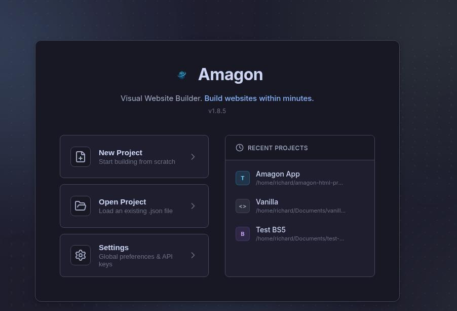

# Amagon HTML Editor

<p align="center">
  
</p>

An offline visual HTML editor — a Pingendo/Mobirise/Bootstrap Studio alternative for Linux.



## Why "Amagon"?

**Amagon** is derived from the Cebuano (Bisaya) word *Amag*, which means "to glow" or "luminescence". Like a glowing phosphor in a dark terminal, Amagon is designed to illuminate the path between visual design and high-performance code.

---

## Features

### Visual Editing
- **Drag & Drop Canvas**: Build pages by dragging blocks from the sidebar to the canvas
- **Live Preview**: See your changes instantly in an isolated iframe canvas
- **Responsive Preview**: Switch between desktop, tablet, and mobile viewports
- **Block Library**: 50+ pre-built blocks including headers, heroes, grids, forms, and more
- **Custom Components**: Save your own reusable block templates

### Code Integration
- **Monaco Editor**: Full-featured code editor with syntax highlighting and IntelliSense
- **Bidirectional Sync**: Changes in code reflect in the visual editor and vice versa
- **Clean Export**: Export to standalone HTML with no editor artifacts

### Project Management
- **Multi-page Projects**: Create and manage multiple pages in a single project
- **Save/Load**: Native project files (.json) with all assets
- **Asset Manager**: Built-in image and asset management
- **Auto-save**: Automatic background saving

### Advanced Features
- **Undo/Redo**: Full history with 50-step rollback
- **Keyboard Shortcuts**: Power-user shortcuts for all operations (Ctrl+K for command palette)
- **Clipboard Operations**: Copy/paste blocks within and across pages
- **Custom CSS**: Add global styles that apply to all blocks
- **Dark/Light Themes**: Choose your preferred editor theme

## Tech Stack

- **Electron** — Cross-platform desktop app framework
- **Vite** — Fast development and building
- **React** — UI component library
- **TypeScript** — Type-safe JavaScript
- **Zustand** — Lightweight state management
- **Monaco Editor** — VS Code's editor component
- **dnd-kit** — Modern drag and drop primitives
- **Bootstrap 5** — Default CSS framework

## Getting Started

### Prerequisites
- Node.js 18+
- npm

### Install & Run

```bash
npm install
npm run dev
```

### Build

```bash
npm run build        # Full Electron build
npm run build:web    # Web-only build
npm test             # Run tests
```

## Keyboard Shortcuts

| Shortcut | Action |
|----------|--------|
| `Ctrl+S` | Save project |
| `Ctrl+Shift+S` | Save As |
| `Ctrl+O` | Open project |
| `Ctrl+Z` | Undo |
| `Ctrl+Y` / `Ctrl+Shift+Z` | Redo |
| `Ctrl+C` | Copy selected block |
| `Ctrl+X` | Cut selected block |
| `Ctrl+V` | Paste block |
| `Ctrl+D` | Duplicate selected block |
| `Delete` / `Backspace` | Delete selected block |
| `Escape` | Deselect / Cancel drag |
| `Ctrl+E` | Toggle code editor |
| `Ctrl+\` | Toggle left sidebar |
| `Ctrl+/` | Toggle right sidebar |
| `Ctrl+K` | Open command palette |
| `Ctrl+?` | Show keyboard shortcuts |

## Project Structure

```
src/
├── main/                 # Electron main process
├── preload/             # Electron preload scripts
├── preview/             # Canvas runtime (iframe content)
├── renderer/            # React app
│   ├── components/      # React components
│   ├── hooks/          # Custom React hooks
│   ├── registry/       # Block definitions
│   ├── store/          # Zustand stores
│   ├── styles/         # CSS styles
│   └── utils/          # Utility functions
└── types/              # TypeScript types
```

## Architecture

### State Management
- **EditorStore**: Current page blocks, selection, history (undo/redo), clipboard
- **ProjectStore**: Project settings, pages, user blocks, file paths

### Canvas Rendering
The canvas runs in an isolated iframe for security. Blocks are rendered to HTML, sent via postMessage, and interactions are relayed back.

## Export

Projects export to clean HTML:
- No editor artifacts
- Optional inlined or external CSS
- Asset consolidation
- Standalone output


## The Story of "Hoarses"

During the initial scaffolding phase, the developer wanted a name that sounded fast but was unique enough to avoid conflicts with existing npm packages. **"Hoarses"** was chosen because it sounded like a heavy, breathing engine, but the extra "a" and "e" were added to ensure the internal directory names remained unique in the terminal.

Over time, it became a badge of honor among the contributors: **"Amagon is what the world sees, but Hoarses is the engine that screams"**.

## License

Private / internal project.

