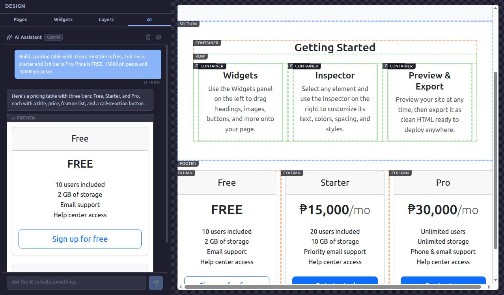
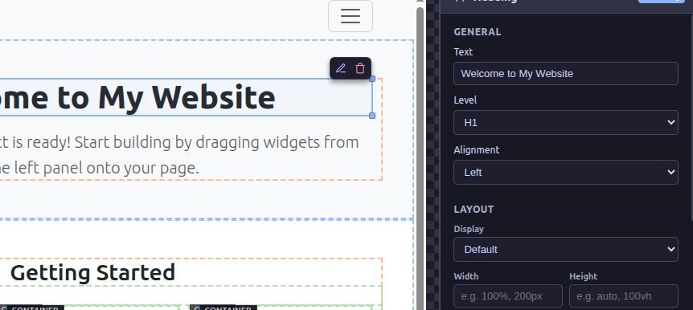
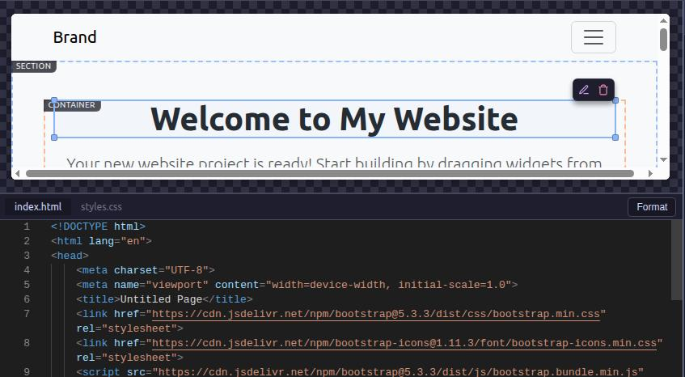
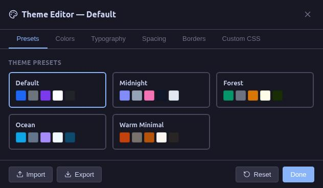

# Amagon HTML Editor

<p align="center">
  
</p>

An offline, AI-powered visual HTML editor. A multiplatform Pingendo/Mobirise/Bootstrap Studio alternative.

[amagon.app](https://amagon.app)


## Why "Amagon"?

**Amagon** is derived from the Cebuano (Bisaya) word *Amag*, which means "to glow" or "luminescence". Like a glowing phosphor in a dark terminal, Amagon is designed to illuminate the path between visual design and high-performance code.

---

## Features

### AI Assistant



Amagon ships with a built-in AI assistant that understands your project's block structure, theme, and design system so you can build pages with natural language.

- **Multi-Provider Support**: Connect to **OpenAI** (GPT-4o, o3-mini, etc.), **Anthropic** (Claude Sonnet/Opus/Haiku), **Google** (Gemini 2.5 Flash/Pro, etc.), or **Ollama** for fully offline local LLM inference
- **Generate UI Components**: Describe what you want ("Build a pricing table with 3 tiers") and the AI produces ready-to-insert blocks that follow your project's block schema
- **Theme-Aware Generation**: The AI automatically receives your project's theme variables (colors, typography, spacing) so generated components stay visually consistent
- **Conversational Chat**: Ask questions, get design advice, or request modifications to existing blocks from a sidebar chat panel
- **One-Click Insert**: AI-generated blocks include a live preview and can be inserted into the canvas with a single click
- **Secure Key Storage**: API keys are encrypted via the OS keyring (`safeStorage`) and never leave the main process. On Linux systems without a supported keyring, keys are encrypted using a machine-derived AES key as a fallback
- **Dynamic Model Discovery**: Available models are fetched live from each provider's API. Ollama models are auto-detected from your local server
- **AI Proposal Review**: AI-suggested changes to CSS files and event handlers are shown in a Monaco diff editor with Apply / Discard actions before anything is committed

### Visual Editing



- **Drag & Drop Canvas**: Build pages by dragging blocks from the sidebar to the canvas
- **Live Preview**: See your changes instantly in an isolated iframe canvas
- **Inline Editing**: Double-click any text block on the canvas to edit content directly in place
- **Responsive Preview**: Switch between desktop, tablet, and mobile viewports
- **Zoom Controls**: Adjust canvas zoom via [+]/[-] buttons, a slider, or by typing a value directly
- **Block Library**: 50+ pre-built blocks including headers, heroes, grids, forms, navbars, footers, code blocks, and more — with a search bar for quick filtering
- **Custom Components**: Save your own reusable block templates
- **Floating Toolbar**: Context-aware toolbar appears on hover with quick edit, duplicate, delete, and move actions

### Code Integration



- **Monaco Editor**: Full-featured code editor (same engine behind VS Code) with syntax highlighting and IntelliSense
- **Bidirectional Sync**: Changes in code reflect in the visual editor and vice versa
- **Code Syntax Highlighting**: Code blocks in the canvas are rendered with highlight.js syntax coloring
- **Clean Export**: Export to standalone HTML with no editor artifacts

### Theme System



- **Visual Theme Editor**: Customize your entire site's look from a dedicated editor with tabs for colors, typography, spacing, borders, and custom CSS
- **Theme Presets**: Choose from built-in presets to quickly set a cohesive visual style
- **CSS Variables Pipeline**: Theme changes compile to CSS custom properties (`--theme-primary`, `--theme-bg`, `--theme-font-family`, etc.) that cascade through all blocks
- **Import/Export Themes**: Save and load theme JSON files for reuse across projects

### Inspector Panel

- **Property Editor**: Edit every block's props through auto-generated forms (text, number, boolean, select, color picker, image, measurement)
- **Style Editors**: Dedicated sub-panels for layout (display/flexbox), spacing (margin/padding), typography, background, and border
- **Responsive Overrides**: Add responsive CSS class overrides per breakpoint
- **CSS Class Editor**: Fine-tune Bootstrap or custom CSS classes on any block
- **Block Actions**: Duplicate, delete, move up/down, wrap in container, or save as a user component from the inspector

### Credential Manager

- **Centralized Key Overview**: View all stored API keys from a single popover accessible in the toolbar, with masked values and per-service labels
- **Encryption Status**: A banner shows whether your keys are protected by the OS keyring or by machine-derived AES encryption (fallback for Linux systems without a keyring)
- **Security Info Modal**: When running in fallback mode, a detailed modal explains what the machine-derived encryption does, its limitations, and how to set up a proper keyring for stronger protection
- **Per-Key Editing**: Edit individual credentials inline from the Settings → Credentials table via a dedicated edit modal
- **Per-Key Deletion**: Remove individual API keys directly from the credential manager

### Publish to Web

- **One-Click Publishing**: Deploy your site directly from the editor to GitHub Pages, Cloudflare Pages, or Neocities
- **Extensible Provider System**: Built-in providers ship with a versioned `PublisherExtension` API — new hosting targets can be added without touching core editor code
- **Credential Management**: Publish credentials are stored encrypted (OS keyring / AES-256-GCM fallback) and managed separately from AI keys; view, edit, or delete them from Settings
- **Pre-Publish Validation**: Each provider validates credentials and file structure before upload and surfaces actionable warnings in the UI
- **Live Progress**: A progress panel streams phase-by-phase feedback (`validating → exporting → uploading → done`) and shows the final published URL

### Interactive Tutorial

- **Welcome Tour**: First-time users are greeted with a guided tour of core editor features via a spotlight overlay system
- **Branching Paths**: After the core walkthrough, users can choose a deep-dive branch: **AI Assistance**, **Publish Workflow**, or **Web Media Search**
- **Reactive Step Advancement**: Tutorial steps auto-advance when the user completes the expected action (e.g. drag a block, open the theme editor, send an AI message) — no "Next" button required for action steps
- **Spotlight Highlights**: Key UI elements are highlighted with a focused mask; a floating info box with a directional arrow explains each step
- **Restartable**: The tutorial can be restarted at any time from Settings

### Project Management

- **New Project Wizard**: Choose a name and CSS framework (Bootstrap 5, Tailwind CSS, or Vanilla HTML/CSS) to scaffold a new project
- **Multi-Page Projects**: Create and manage multiple pages in a single project
- **Save/Load**: Native project files (.json) with all assets
- **Asset Manager**: Built-in image and asset management with integrated media search (Pexels, Pixabay)
- **Auto-Save**: Automatic background saving
- **Recent Projects**: Welcome screen shows recently opened projects for quick access

### Advanced Features

- **Undo/Redo**: Full history with 50-step rollback
- **Keyboard Shortcuts**: Power-user shortcuts for all operations (Ctrl+K for command palette)
- **Command Palette**: Fuzzy-search any action and execute it instantly
- **Clipboard Operations**: Copy/paste blocks within and across pages
- **Block Tree**: Hierarchical view of the page's DOM-like block tree in the sidebar
- **Custom CSS**: Add global styles that apply to all blocks
- **Dark/Light Themes**: Choose your preferred editor UI theme
- **Flexible Layouts**: Switch between standard, no-sidebar, no-inspector, canvas-only, code-focus, and zen modes
- **Export Options**: Multi-file (all pages) or single self-contained HTML export with optional minification and JS inclusion
- **Preview in Browser**: One-click preview of exported pages in your default browser
- **Lazy Loading**: Heavy components (code editor, dialogs) are code-split and lazy-loaded for fast startup

## Getting Started

```bash
npm install
npm run dev
```

See [docs/development.md](docs/development.md) for the full development guide, build commands, and Linux sandbox setup.

## System Requirements & Compatibility

Amagon targets standard Windows 10/11 and mainstream Linux distributions. See [docs/post-install.md](docs/post-install.md) for known compatibility issues and fixes (ReviOS, Ubuntu 24.04+ sandbox crash, etc.).

## AI Setup

Amagon's AI assistant works with any of the following providers:

| Provider | Setup |
|----------|-------|
| **OpenAI** | Enter your API key in the AI settings panel |
| **Anthropic** | Enter your API key in the AI settings panel |
| **Google (Gemini)** | Enter your API key in the AI settings panel |
| **Ollama** (local) | Install [Ollama](https://ollama.com/), pull a model, and it auto-connects at `localhost:11434`. No API key needed |

Open the AI panel from the sidebar, click the settings icon, select your provider, and enter your API key. For Ollama, just select it for local inference. The AI will automatically discover available models.

## Keyboard Shortcuts

| Shortcut | Action |
|----------|--------|
| `Ctrl+S` | Save project |
| `Ctrl+Shift+S` | Save As |
| `Ctrl+O` | Open project |
| `Ctrl+Z` | Undo |
| `Ctrl+Y` / `Ctrl+Shift+Z` | Redo |
| `Ctrl+C` | Copy selected block |
| `Ctrl+X` | Cut selected block |
| `Ctrl+V` | Paste block |
| `Ctrl+D` | Duplicate selected block |
| `Delete` / `Backspace` | Delete selected block |
| `Escape` | Deselect / Cancel drag |
| `Ctrl+E` | Toggle code editor |
| `Ctrl+\` | Toggle left sidebar |
| `Ctrl+/` | Toggle right sidebar |
| `Ctrl+K` | Open command palette |
| `Ctrl+?` | Show keyboard shortcuts |

## Project Structure

```
src/
├── main/                 # Electron main process
│   ├── aiService.ts      # AI provider adapters + secure key storage
│   ├── credentialCatalog.ts  # Credential definition registry
│   └── publishCredentials.ts # Publish credential storage
├── preload/             # Electron preload scripts
├── preview/             # Canvas runtime (iframe content)
├── publish/             # Publish-to-web extension system
│   ├── registry.ts      # Publisher registration
│   ├── types/           # Extension API types
│   ├── providers/       # GitHub Pages, Cloudflare Pages, Neocities
│   └── validators/      # Per-provider validators
├── renderer/            # React app
│   ├── components/      # React components
│   │   ├── AiAssistant/ # AI chat panel + settings
│   │   ├── Canvas/      # Visual canvas (iframe)
│   │   ├── CodeEditor/  # Monaco code editor
│   │   ├── Inspector/   # Property/style inspector
│   │   ├── ThemeEditor/ # Visual theme customization
│   │   ├── PublishDialog/ # Publish-to-web UI
│   │   ├── Tutorial/    # Interactive onboarding overlay
│   │   └── ...          # Toolbar, Sidebar, CommandPalette, etc.
│   ├── hooks/           # Custom React hooks
│   ├── registry/        # Block definitions (50+ types)
│   ├── store/           # Zustand stores (includes tutorialStore)
│   ├── styles/          # CSS styles
│   └── utils/           # Utility functions
└── types/               # TypeScript types
```

## Tech Stack

- **Electron**: Cross-platform desktop app framework
- **Vite**: Fast development and building
- **React**: UI component library
- **TypeScript**: Type-safe JavaScript
- **Zustand**: Lightweight state management
- **Monaco Editor**: VS Code's editor component
- **highlight.js**: Syntax highlighting for code blocks
- **dnd-kit**: Modern drag and drop primitives
- **Lucide React**: Icon library
- **react-resizable-panels**: Resizable split panes
- **parse5**: HTML parsing for bidirectional code sync
- **Bootstrap 5**: Default CSS framework for generated pages

## Architecture

### State Management
- **EditorStore**: Current page blocks, selection, history (undo/redo), clipboard
- **ProjectStore**: Project settings, pages, user blocks, file paths, theme
- **AiStore**: Chat messages, AI configuration, model lists, provider state

### Canvas Rendering
The canvas runs in an isolated iframe for security. Blocks are rendered to HTML, sent via postMessage, and interactions are relayed back.

### AI Pipeline
1. User sends a message from the AI chat panel
2. The renderer forwards the prompt (with block registry + theme context) to the main process via IPC
3. The main process builds a system prompt describing the block schema and theme, then dispatches to the selected provider adapter
4. The response is parsed for JSON blocks or plain text and returned to the renderer
5. Generated blocks can be previewed inline and inserted into the canvas with one click

## Export

Projects export to clean HTML:
- No editor artifacts
- Optional inlined or external CSS
- Multi-page site or single self-contained HTML file
- Minification support
- Asset consolidation
- Standalone output ready for deployment


## The Story of "Hoarses"

During the initial scaffolding phase, the developer wanted a name that sounded fast but was unique enough to avoid conflicts with existing npm packages. **"Hoarses"** was chosen because it sounded like a heavy, breathing engine. The extra "a" and "e" were added to ensure the internal directory names stayed unique in the terminal.

Over time, it became a badge of honor among the contributors: **"Amagon is what the world sees, but Hoarses is the engine that screams"**.

## License

This project is licensed under the **GNU General Public License v3.0**. See the [LICENSE.txt](LICENSE.txt) file for details.
