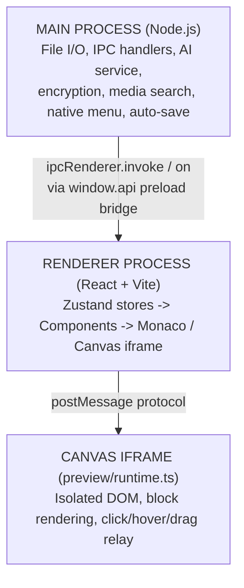

# Getting Started as a Contributor

Welcome to **Amagon** (internal codename: *Hoarses*). This guide will get you from zero to productive in the codebase.

Amagon is a desktop HTML editor built with Electron, React, and TypeScript. You drag-and-drop blocks onto a canvas, edit properties in an inspector panel, switch to a Monaco code editor for raw HTML when you need it, and export standalone sites. It is an alternative to tools like Pingendo or Bootstrap Studio, with a built-in AI assistant that understands your project's block structure and theme.

> **For AI assistants:** read `.aiassistant/rules/project-context.md` first, then come back here for the human-friendly tour.

---

## First Steps

1. **Clone and install**
   ```bash
   npm install
   npm run dev
   ```
2. **Read the dev guide** — See [`docs/development.md`](development.md) for build commands, test commands, and Linux sandbox setup.
3. **Read the architecture overview** — [`GUIDELINES.md`](../GUIDELINES.md) at the repo root is the single most important file for understanding how the codebase is organized. It covers:
   - Tech stack and project structure
   - Data models (Block, ProjectTheme, FontAsset, etc.)
   - Zustand stores and their responsibilities
   - IPC channels reference
   - Architecture diagrams
   - Conventions and patterns
4. **Skim the project context** — [`.aiassistant/rules/project-context.md`](../.aiassistant/rules/project-context.md) is written for AI agents but is also a dense, accurate cheat-sheet of the project's key systems and hard constraints.

---

## Architecture at a Glance

The app runs in three layers:



All main ↔ renderer communication goes through the typed `window.api` bridge defined in `src/preload/index.ts`. Never use `ipcRenderer` directly in renderer code.

---

## Where to Look for What

### I want to work on...

| Feature area                                              | Start with these files                                                                                                                               |
|-----------------------------------------------------------|------------------------------------------------------------------------------------------------------------------------------------------------------|
| **Visual canvas / blocks**                                | `src/renderer/components/Canvas/Canvas.tsx`, `src/preview/runtime.ts`, `src/renderer/registry/registerBlocks.ts`                                     |
| **Block definitions / adding a new block type**           | `src/renderer/registry/registerBlocks.ts`, `src/renderer/registry/ComponentRegistry.ts`                                                              |
| **Inspector panel (property editor)**                     | `src/renderer/components/Inspector/Inspector.tsx` and its sub-components                                                                             |
| **Theme editor / colors / typography**                    | `src/renderer/components/ThemeEditor/ThemeEditor.tsx`, `src/renderer/themes/themePacks.ts`, `src/renderer/themes/componentTokens.ts`                 |
| **Theme gallery / presets**                               | `src/renderer/themes/themeGalleryRegistry.ts`, `src/renderer/themes/themePacks.ts`, `src/renderer/components/ThemeGallery/ThemeMiniPreview.tsx`      |
| **Page / section templates**                              | `src/renderer/templates/pageTemplates.ts`, `src/renderer/templates/sectionTemplates.ts`, `src/renderer/templates/templateTypes.ts`                   |
| **AI chat assistant**                                     | `src/renderer/components/AiAssistant/AiAssistant.tsx`, `src/main/aiService.ts`                                                                       |
| **AI provider adapters (OpenAI, Anthropic, Ollama, CLI)** | `src/main/aiService.ts`, `src/main/cliHelpers.ts`                                                                                                    |
| **Settings dialog**                                       | `src/renderer/components/SettingsDialog/SettingsDialog.tsx`, `src/renderer/store/appSettingsStore.ts`                                                |
| **Credentials / API key management**                      | `src/main/credentialCatalog.ts`, `src/renderer/components/SettingsDialog/CredentialEditModal.tsx`                                                    |
| **Publish to web**                                        | `src/publish/registry.ts`, `src/publish/providers/`, `src/renderer/components/PublishDialog/PublishDialog.tsx`                                       |
| **Tutorial / onboarding**                                 | `src/renderer/components/Tutorial/tutorialSteps.ts`, `src/renderer/store/tutorialStore.ts`                                                           |
| **Code editor (Monaco)**                                  | `src/renderer/components/CodeEditor/CodeEditor.tsx`                                                                                                  |
| **Fonts / Google Fonts browser**                          | `src/renderer/components/ThemeEditor/FontManager.tsx`, `src/renderer/components/ThemeEditor/GoogleFontBrowser.tsx`                                   |
| **Export engine**                                         | `src/renderer/utils/exportEngine.ts`, `src/renderer/utils/blockToHtml.ts`                                                                            |
| **Keyboard shortcuts / command palette**                  | `src/renderer/hooks/useKeyboardShortcuts.ts`, `src/renderer/components/CommandPalette/CommandPalette.tsx`                                            |
| **Toolbar / status bar / sidebar**                        | `src/renderer/components/Toolbar/Toolbar.tsx`, `src/renderer/components/StatusBar/StatusBar.tsx`, `src/renderer/components/Sidebar/Sidebar.tsx`      |
| **Data models / TypeScript types**                        | `src/renderer/store/types.ts`                                                                                                                        |
| **State management**                                      | `src/renderer/store/editorStore.ts`, `src/renderer/store/projectStore.ts`, `src/renderer/store/aiStore.ts`, `src/renderer/store/appSettingsStore.ts` |
| **Main process IPC handlers**                             | `src/main/index.ts`                                                                                                                                  |
| **Preload / bridge**                                      | `src/preload/index.ts`                                                                                                                               |

---

## Key Patterns to Know

1. **Block-based model** — The UI is a tree of `Block` objects, not direct DOM manipulation. Blocks have `id`, `type`, `props`, `styles`, `classes`, `events`, `children`.
2. **Bidirectional sync** — `blockToHtml` and `htmlToBlocks` keep the visual canvas and code editor in sync.
3. **Zustand stores** — State is split across focused stores: `editorStore`, `projectStore`, `aiStore`, `appSettingsStore`, `tutorialStore`.
4. **Canvas isolation** — The live preview runs in an iframe (`src/preview/runtime.ts`). The renderer and iframe communicate via `postMessage`.
5. **No direct DOM manipulation** in the renderer. All visual changes flow through the block model → `blockToHtml` → canvas iframe re-render.
6. **IPC bridge** — `window.api` is the only way renderer code talks to the main process. It is typed in `src/preload/index.ts`.
7. **Block IDs** — generated with prefix `blk_` followed by a random string.
8. **History** — 50-entry undo/redo stack managed by `editorStore`. Mutations push snapshots; undo/redo restores them.

---

## Conventions

- **Component files** use PascalCase (e.g. `ThemeEditor.tsx`) and live in their own folder under `src/renderer/components/`.
- **Store files** use camelCase (e.g. `editorStore.ts`).
- **CSS** — component-scoped CSS files in `styles/` or co-located. Theme uses CSS custom properties (`--theme-*`).
- **Never suppress types** — No `as any`, `@ts-ignore`, or `@ts-expect-error`.
- **Never use empty catch blocks** — Always handle or log errors.

---

## Testing

```bash
npm test         # Run all tests (vitest)
npm test:watch   # Watch mode
```

Tests live next to their source files (e.g. `Foo.tsx` → `Foo.test.tsx` or `__tests__/foo.test.ts`).

---

## Need More Context?

- **Architecture deep dive** → [`GUIDELINES.md`](../GUIDELINES.md)
- **Quick system cheat-sheet** → [`.aiassistant/rules/project-context.md`](../.aiassistant/rules/project-context.md)
- **Development / build / Linux sandbox** → [`docs/development.md`](development.md)
- **Known compatibility issues** → [`docs/post-install.md`](post-install.md)

Happy hacking.
