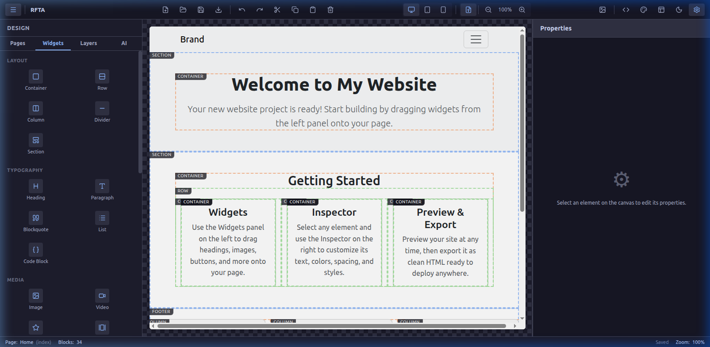

# Amagon Editor Tutorial

Amagon is a visual website builder that lets you create websites within minutes. This tutorial covers the basics of using the editor interface.

## The Main Editor View

When you open a project or start from scratch, you will see the main editor view which consists of three main areas:
- **Left Panel:** Contains layouts, typography elements, and media widgets that you can add to your page.
- **Center Canvas:** The actual page you are designing.
- **Right Inspector Panel:** Where you can modify properties of selected elements.

## Adding Components

To add a new component to your page, open the **Widgets** tab on the left panel. Simply click and drag a component into the center canvas.

## Editing Properties

Once a component is placed on the canvas, click on it to select it. When an element is selected, its properties will appear on the right side in the **Inspector** panel. 
Here you can edit text, layout settings, spacing, alignment, typography, and much more!

