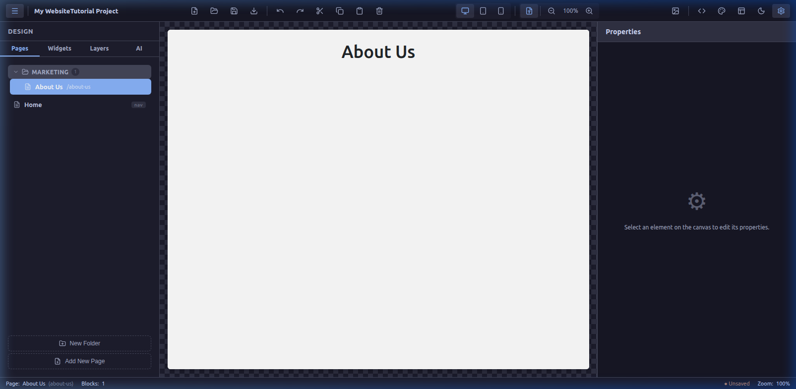
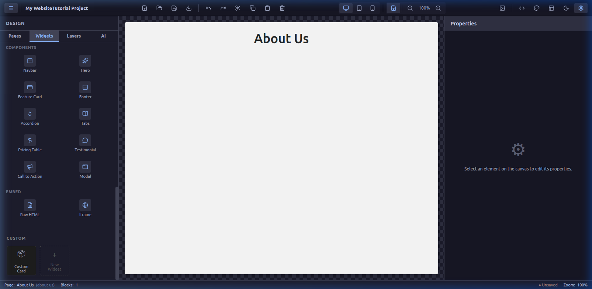
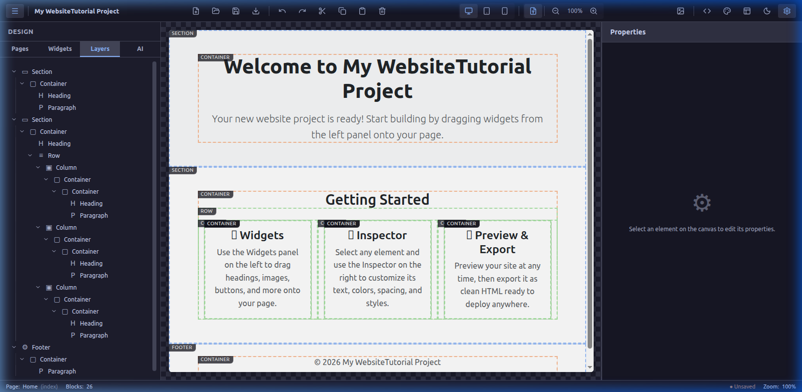
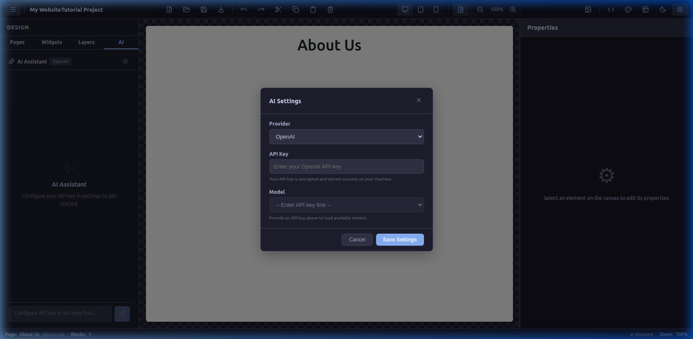
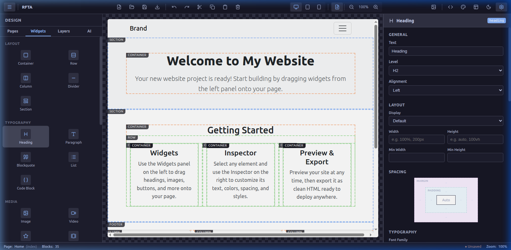
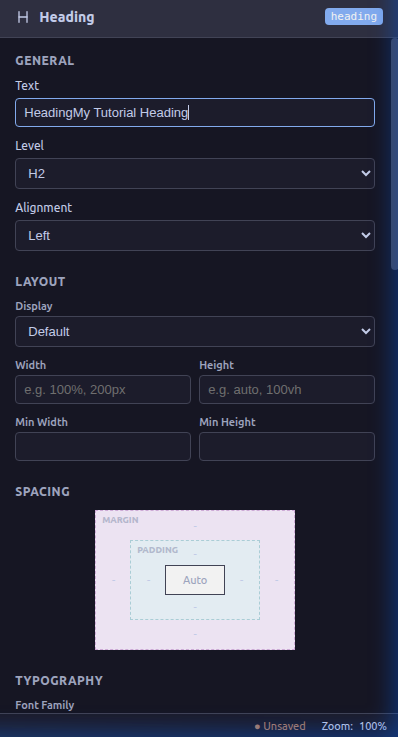
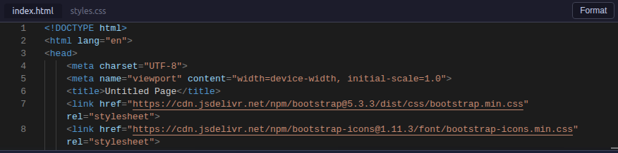

# Amagon Editor Comprehensive Tutorial

Amagon is a powerful visual website builder that lets you create websites within minutes. This tutorial covers the advanced features of the editor interface, detailing each panel, tool, and shortcut to maximize your productivity.

---

## 1. Top Menus and Toolbar
The top toolbar provides essential project and editing controls at your fingertips:
- **Project Files:** Add new files, open folders, save progress, or export your final HTML.
- **Edit Controls:** Undo (`↶`), Redo (`↷`), Cut (`✂`), Copy (`📄`), Paste (`📋`), and Delete (`🗑`).
- **Responsive Views:** Instantly switch your canvas between **Desktop**, **Tablet**, and **Mobile** views to ensure your design is responsive.
- **Code & Theme:** Toggle the Code Editor (`< >`), access the color palette, switch between Light/Dark modes (`🌙`), and open Workspace Settings (`⚙`).

## 2. Left Sidebar
The left sidebar is your primary tool for navigating and building the structure of your website. It is divided into four main tabs:

### Pages Tab
Manage the structure of your website's pages. 

- **Adding a New Page:** Click the **Add New Page** button at the bottom of the tab. You will be prompted to enter a name (e.g., "About Us") and a URL slug (e.g., "/about-us").
- **Organizing with Folders:** Keeping your project tidy is essential as it grows. Click **New Folder** to create a category (e.g., "Marketing" or "Legal"). 
- **Nesting Pages:** You can drag and drop any individual page directly into a folder. This helps you visually group related pages together, making navigation of large projects much easier.

### Widgets Tab
This is where the magic happens. The Widgets tab contains all the building blocks for your site broken down by category:
- **Layout:** Containers, Rows, Columns, Sections. Use these to structure where your content goes.
- **Typography:** Headings, Paragraphs, Quotes.
- **Media:** Images, Videos.

**Custom Widgets:**
Amagon isn't just limited to standard blocks. If you build a complex layout—say a beautiful "Pricing Card" consisting of a container, heading, list, and button—you don't have to rebuild it every time. You can save combined elements as a **Custom Widget**. 
Custom widgets will appear in their own dedicated "Custom" section at the bottom of the Widgets tab, allowing you to drag and drop your own pre-built components anywhere in your project just like native widgets!

### Layers Tab
The Layers tab provides a tree-view outline of the elements on your selected page. This is incredibly useful for:
- Understanding the DOM hierarchy (e.g., seeing which elements are nested inside a Container or Row).
- Selecting elements that are visually hard to click on the canvas.
- Reordering elements by dragging them within the tree.

### AI Tab
Need a jumpstart? The AI Assistant tab allows you to integrate powerful generative AI directly into your workflow.

- **Setup Your Agent:** Before you begin, click the **Settings (gear) icon** in the AI tab. A modal will appear where you can securely enter your OpenAI API key and select your preferred model (e.g., GPT-4o).
- **Benefits:** Once configured, the AI can act as your personal web developer. You can prompt it to generate entire sections of a website, write contextual placeholder copy, or suggest color palettes. It drastically reduces the time from blank canvas to final design.

---

## 3. The Canvas: Drag and Drop
The center area is the canvas where your website comes to life.
- **Adding Elements:** Drag elements from the Widgets tab and drop them where you want them. Visual indicators will show you where the element can be placed.
- **Interacting:** Click on any element on the canvas to select it. Once selected, its properties will be loaded in the Right Sidebar.
- **Inline Editing:** Some text elements can be edited directly on the canvas simply by double-clicking them.

---

## 4. Right Sidebar: Deep Dive into the Properties Inspector
When you select an element on the canvas (or via the Layers tab), the right sidebar becomes your Properties Inspector. This panel is categorized to give you unparalleled, granular control over every CSS property:

- **General:** Modify the element's core content. For a Heading, this is where you change the text itself and select the HTML tag level (H1, H2, H3, etc.). For an image, this is where you paste the image source URL.
- **Layout (Flexbox & Grid):** Adjust how the element behaves in relation to others. Set Display types (block, inline, flex), define specific Widths and Heights (using px, %, or vh/vw), and control Flexbox alignment properties to center or distribute content perfectly.
- **Spacing (The Box Model):** A visual interface for manipulating Margins (space *outside* the element) and Padding (space *inside* the element). You can click and drag values to see the layout shift in real-time on the canvas.
- **Typography:** Change Font Families (integrate Google Fonts), adjust Font Sizes, set Line Heights for readability, and pick Text Colors.
- **Background & Borders:** Apply solid colors or gradient Backgrounds. Add Borders with specific widths, styles (solid, dashed), colors, and Border Radiuses to round the corners of your containers.
- **Effects:** Add professional polish like Box Shadows or Opacity adjustments.

 Every change made in the Inspector instantly updates the element on the canvas.

---

## 5. Built-In Code Editor
For developers who want ultimate control, Amagon includes a built-in code editor. 
- Click the `< >` icon in the top right toolbar to open the code view at the bottom of the screen.
- Here you can view and edit the raw HTML and CSS directly. Changes made here will reflect back to the visual canvas, providing a true bidirectional editing experience.

---

## 6. Essential Keyboard Shortcuts
Speed up your workflow by mastering these keyboard shortcuts:
- `Ctrl + Z` / `Cmd + Z`: Undo the last action
- `Ctrl + Y` / `Cmd + Shift + Z`: Redo the last undone action
- `Ctrl + C` / `Cmd + C`: Copy the selected element
- `Ctrl + V` / `Cmd + V`: Paste the copied element
- `Ctrl + X` / `Cmd + X`: Cut the selected element
- `Delete` / `Backspace`: Delete the selected element
- `Ctrl + S` / `Cmd + S`: Save the project

---

*Now you are fully equipped to build stunning, responsive websites with Amagon. Happy Building!*
