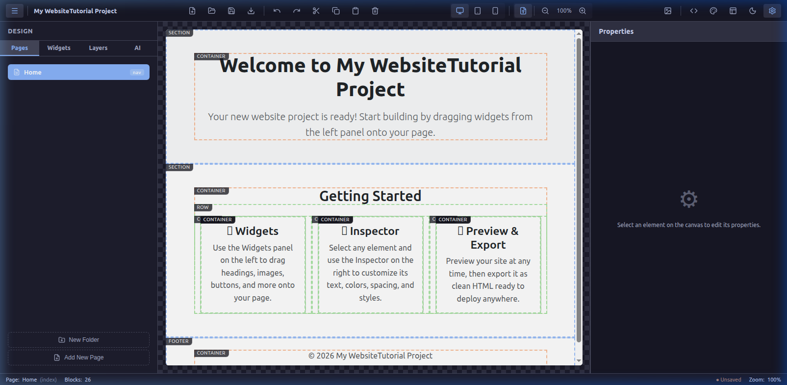
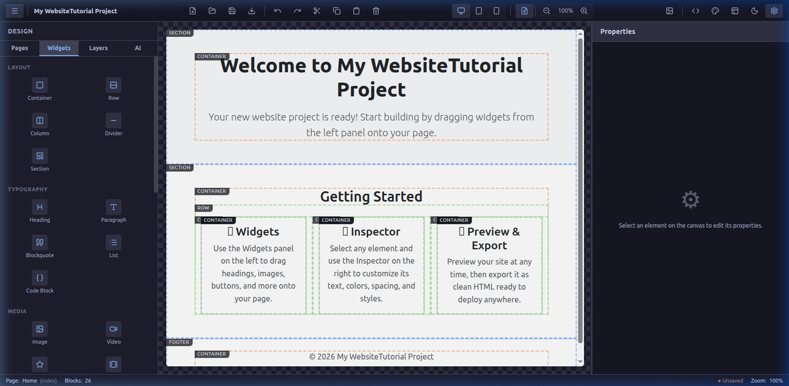
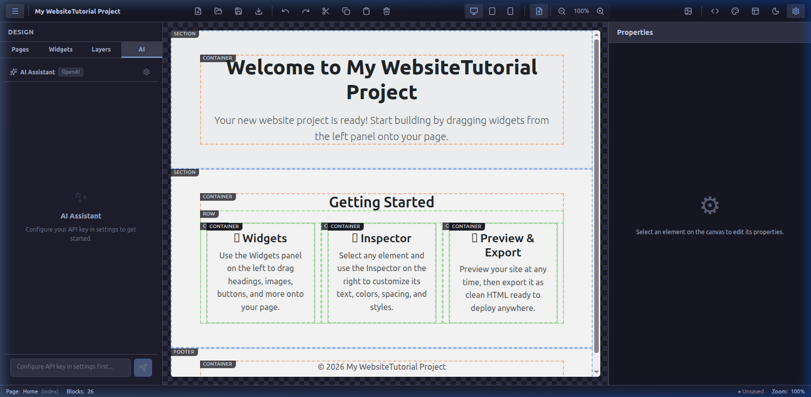

# Amagon Editor Comprehensive Tutorial

Amagon is a powerful visual website builder that lets you create websites within minutes. This tutorial covers the advanced features of the editor interface, detailing each panel, tool, and shortcut to maximize your productivity.

---

## 1. Top Menus and Toolbar
The top toolbar provides essential project and editing controls at your fingertips:
- **Project Files:** Add new files, open folders, save progress, or export your final HTML.
- **Edit Controls:** Undo (`↶`), Redo (`↷`), Cut (`✂`), Copy (`📄`), Paste (`📋`), and Delete (`🗑`).
- **Responsive Views:** Instantly switch your canvas between **Desktop**, **Tablet**, and **Mobile** views to ensure your design is responsive.
- **Code & Theme:** Toggle the Code Editor (`< >`), access the color palette, switch between Light/Dark modes (`🌙`), and open Workspace Settings (`⚙`).

## 2. Left Sidebar
The left sidebar is your primary tool for navigating and building the structure of your website. It is divided into four main tabs:

### Pages Tab
Manage the structure of your website's pages. You can add new pages, create folders to stay organized, and quickly switch between different pages in your project.

### Widgets Tab
This is where the magic happens. The Widgets tab contains all the building blocks for your site:
- **Layouts:** Containers, Rows, Columns, Sections.
- **Typography:** Headings, Paragraphs, Quotes.
- **Media:** Images, Videos.
**Drag and Drop:** Simply click and drag any widget from this panel directly onto the center canvas to add it to your page!

### Layers Tab
The Layers tab provides a tree-view outline of the elements on your selected page. This is incredibly useful for:
- Understanding the DOM hierarchy (e.g., seeing which elements are nested inside a Container or Row).
- Selecting elements that are visually hard to click on the canvas.
- Reordering elements by dragging them within the tree.

### AI Tab
Need a jumpstart? The AI Assistant tab allows you to configure your OpenAI API key and use AI to generate layouts, suggest styles, or help you build complex website sections automatically!

---

## 3. The Canvas: Drag and Drop
The center area is the canvas where your website comes to life.
- **Adding Elements:** Drag elements from the Widgets tab and drop them where you want them. Visual indicators will show you where the element can be placed.
- **Interacting:** Click on any element on the canvas to select it. Once selected, its properties will be loaded in the Right Sidebar.
- **Inline Editing:** Some text elements can be edited directly on the canvas simply by double-clicking them.

---

## 4. Right Sidebar: Properties Inspector
When you select an element on the canvas (or via the Layers tab), the right sidebar becomes your Properties Inspector. This panel allows unparalleled control over the element:
- **General:** Modify the element's core content, such as text, heading levels (H1, H2, etc.), or image sources.
- **Layout:** Adjust the element's Display type (block, inline, flex), Width, Height, and Alignment.
- **Spacing:** Visually manipulate margins and padding to get the layout exactly right.
- **Typography:** Change fonts, sizes, weights, and colors.
- **Styling:** Add borders, backgrounds, shadows, and more.

---

## 5. Built-In Code Editor
For developers who want ultimate control, Amagon includes a built-in code editor. 
- Click the `< >` icon in the top right toolbar to open the code view at the bottom of the screen.
- Here you can view and edit the raw HTML and CSS directly. Changes made here will reflect back to the visual canvas, providing a true bidirectional editing experience.

---

## 6. Essential Keyboard Shortcuts
Speed up your workflow by mastering these keyboard shortcuts:
- `Ctrl + Z` / `Cmd + Z`: Undo the last action
- `Ctrl + Y` / `Cmd + Shift + Z`: Redo the last undone action
- `Ctrl + C` / `Cmd + C`: Copy the selected element
- `Ctrl + V` / `Cmd + V`: Paste the copied element
- `Ctrl + X` / `Cmd + X`: Cut the selected element
- `Delete` / `Backspace`: Delete the selected element
- `Ctrl + S` / `Cmd + S`: Save the project

---

*Now you are fully equipped to build stunning, responsive websites with Amagon. Happy Building!*
